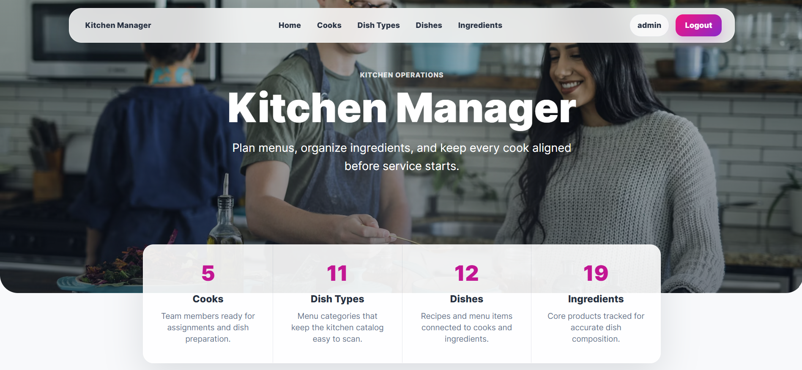

# Kitchen Management System

A Django web application for managing everyday kitchen operations in a restaurant or catering team. It keeps cooks, dish types, dishes, and ingredients in one place, with authenticated CRUD workflows and a dashboard for quick operational visibility.

## Demo



## Features

- Authentication-protected kitchen management pages
- Dashboard with counts for cooks, dishes, dish types, and ingredients
- CRUD workflows for cooks, dish types, dishes, and ingredients
- Custom `Cook` user model with years of experience
- Dish records with price, description, dish type, assigned cooks, and ingredient amounts
- Many-to-many dish ingredients through a `DishIngredient` model with units
- Search and pagination on list pages
- Django admin support for back-office data management
- Bootstrap 4 styling with `django-crispy-forms`
- SQLite database for local development

## Tech Stack

- Python
- Django
- SQLite
- Bootstrap 4
- django-crispy-forms
- crispy-bootstrap4

## Requirements

- Python 3.12 or newer recommended
- pip
- Git

## Quick Start

1. Clone the repository:

   ```bash
   git clone <repository-url>
   cd kitchen_management_system
   ```

2. Create and activate a virtual environment:

   ```bash
   python -m venv .venv
   .venv\Scripts\activate
   ```

   On macOS or Linux:

   ```bash
   python3 -m venv .venv
   source .venv/bin/activate
   ```

3. Install dependencies:

   ```bash
   pip install -r requirements.txt
   ```

4. Apply database migrations:

   ```bash
   python manage.py migrate
   ```

5. Create an admin user:

   ```bash
   python manage.py createsuperuser
   ```

6. Start the development server:

   ```bash
   python manage.py runserver
   ```

7. Open the app:

   ```text
   http://127.0.0.1:8000/
   ```

## Usage

Log in with a superuser or cook account, then use the sidebar navigation to manage kitchen data:

- Add cooks and maintain their profile details
- Create dish types such as soups, desserts, or main courses
- Add ingredients once and reuse them across dishes
- Create dishes with prices, descriptions, assigned cooks, and ingredient quantities
- Use search fields and pagination to browse larger data sets

## Main Routes

| Route | Description |
| --- | --- |
| `/` | Dashboard |
| `/accounts/login/` | Login page |
| `/cooks/` | Cook list |
| `/cooks/create/` | Create cook |
| `/dish-types/` | Dish type list |
| `/dish-types/create/` | Create dish type |
| `/dishes/` | Dish list |
| `/dishes/create/` | Create dish |
| `/ingredients/` | Ingredient list |
| `/ingredients/create/` | Create ingredient |
| `/admin/` | Django admin |

Detail, update, and delete views are available from the list and detail pages.

## Project Structure

```text
kitchen_management_system/
|-- kitchen/                     # Main kitchen app
|   |-- admin.py                 # Admin registrations
|   |-- forms.py                 # Forms and dish ingredient formset
|   |-- models.py                # Cook, DishType, Dish, Ingredient models
|   |-- urls.py                  # App routes
|   |-- views.py                 # Dashboard and class-based views
|   `-- migrations/              # Database migrations
|-- kitchen_management_system/   # Project settings and root URL config
|-- static/                      # Static assets
|-- templates/                   # Shared and app templates
|-- manage.py                    # Django management entry point
|-- requirements.txt             # Python dependencies
`-- README.md
```
